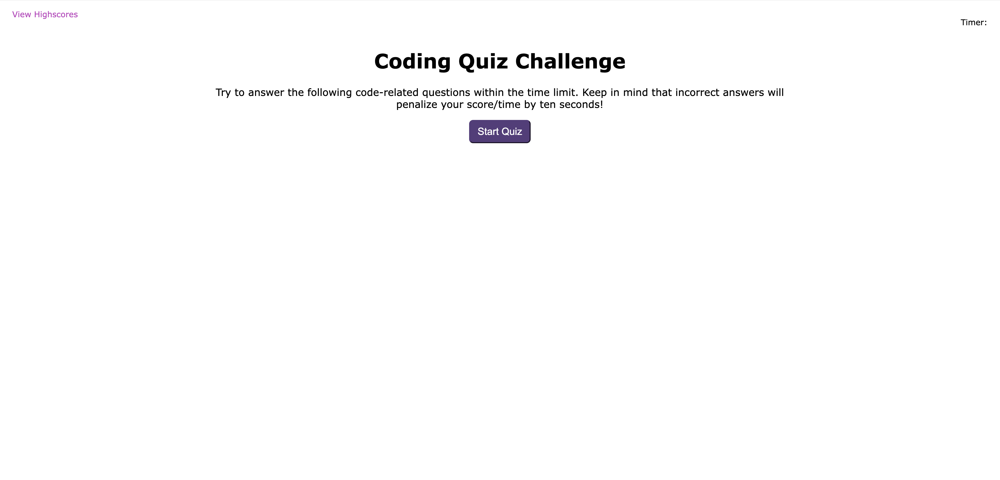

# code-quiz

## Description
A repository for a multiple choice coding quiz. 

## Usage

To use this project, you can review the html, css, and js files. To test your own suggestions on what to adjust in the html or css, open the Chrome DevTools by pressing Command+Option+I (macOS) or Control+Shift+I (Windows). Try any changes in the console panel and see then update in real time. 

Link to the [deployed application](https://amandajduva.github.io/code-quiz/). 

Screenshot of deployed application:

## Credits

While I wrote the code for this application, I received support from received support from a tutor to add to existing functions and to create new functions that dissplay the questions and highscores correctly. 

## License

Please refer to the LICENSE in the repo.